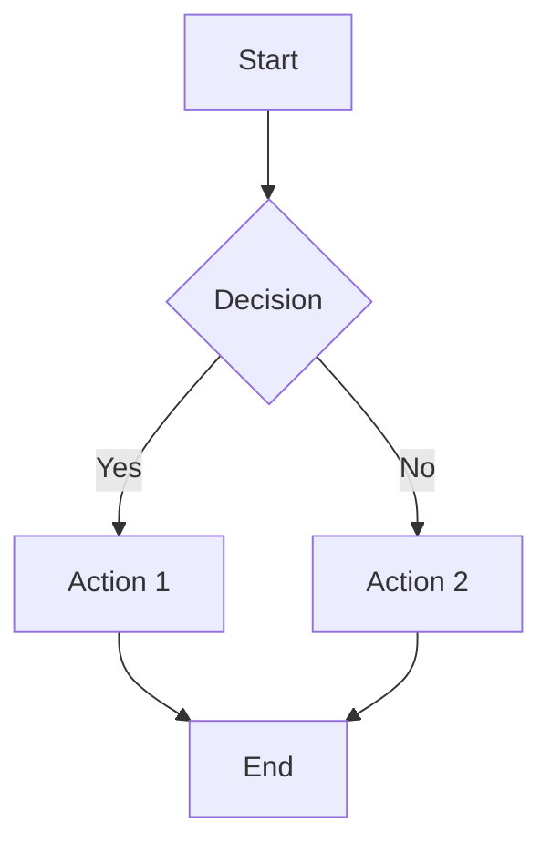
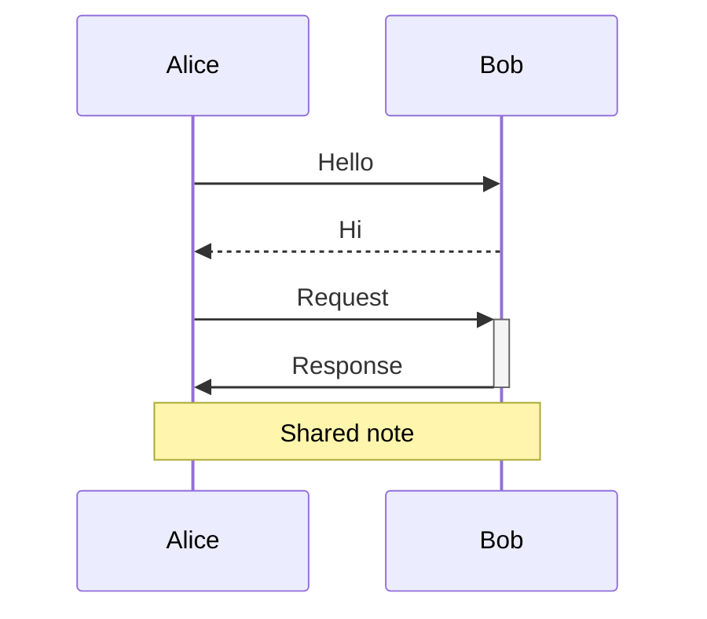
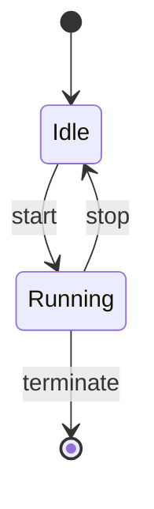
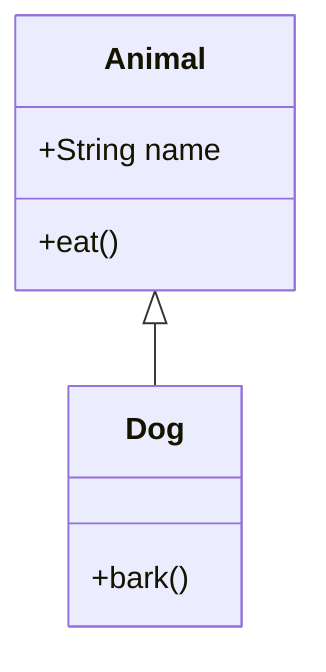
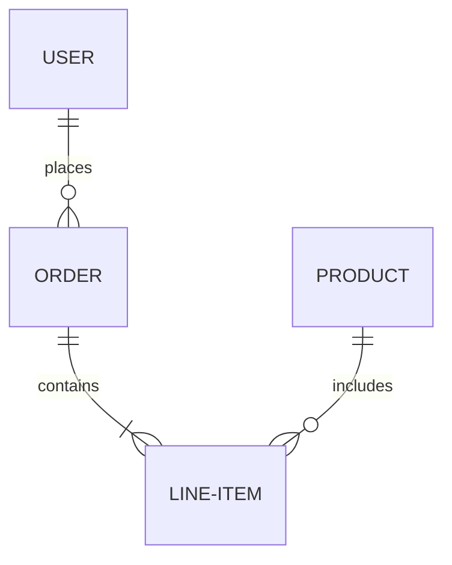

# Mermaid Syntax Quick Reference

## Flowchart

Directions: `TD` (top-down), `LR` (left-right), `BT`, `RL`

Node shapes:

- `A[text]` - rectangle
- `A(text)` - rounded
- `A{text}` - diamond
- `A([text])` - stadium
- `A[[text]]` - subroutine
- `A[(text)]` - cylinder
- `A((text))` - circle

## Sequence Diagram

Arrows: `->>` solid, `-->>` dashed, `-x` cross, `-)` open

## State Diagram

## Class Diagram

Relations: `<|--` inheritance, `*--` composition, `o--` aggregation, `-->` association

## ER Diagram

Cardinality: `||` one, `o|` zero or one, `}|` one or more, `}o` zero or more
